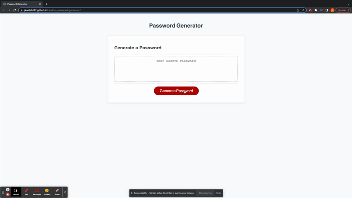

# Random Password Generator

|   Languages   | Used |
| ----------- | ----------- |
| HTML     |    ✅    |
| CSS  |    ✅     |
| JavaScript  |    ✅    |

## Description

This project was about using javascript to create an interactive page that produces a randomly assembled password to a user who can specify the length and character content of the password to be generated. The goal was to build a usable tool that utilizes the basic practices of javascript, including using variables to point to objects in the HTML document, using functions to prompt users to produce a unique output, using variables to store those outputs, using those outputs in other functions, using for loops to populate a variable, using if/else conditionals, and using alerts to pass information to the user.

### The Approach

Working through this project was valuable because it drove home the point of needing to have a plan of attack, even if the plans are to change as you get more into it. Since javascript is relatively new to me, I went through a lot of trial and error in figuring out a workable approach. Twice I had spent a lot of time developing an approach only to end up scraping everything when I realized I had worked myself into a corner. Each time was a lesson, and in a way it felt necessary to make the errors before finding a solution I was happy with. In the end, working the steps out loud and using console.logs to verify each step was executing as intended proved to be very useful. 

### Pseudocode

1. When a user selects the 'Generate Password' button, they are prompted to enter the length they want the password to be, which must be between the values 8 and 128
    - if the entered value is outside the acceptable range, the user will be shown an alert message and no password will be generated
    - if the entered value is within the acceptable range, this value should be saved for later use
2. The user is asked to confirm if they want to include: 
    - lowercase letters
    - upperacse letters
    - numbers
    - special characters
3. If the user selected any of those parameters, the corresponding characters are combined to form a single list of desired values
    - if no characters are selected, an alert message is displayed and no password is generated
4. Characters from the desired list are choosen at random and assigned to the new password, continuing adding one chaaracter at a time until the length is equal to the user submission
5. report the final output to the user as their new password

### App demonstration

#### Usage

Click <a href="https://jkwalsh127.github.io/random-password-generator/">**here**</a> to check out the deployed generator!

#### Credits

Staff at UC Berkeley Extension full-stack coding bootcamp
